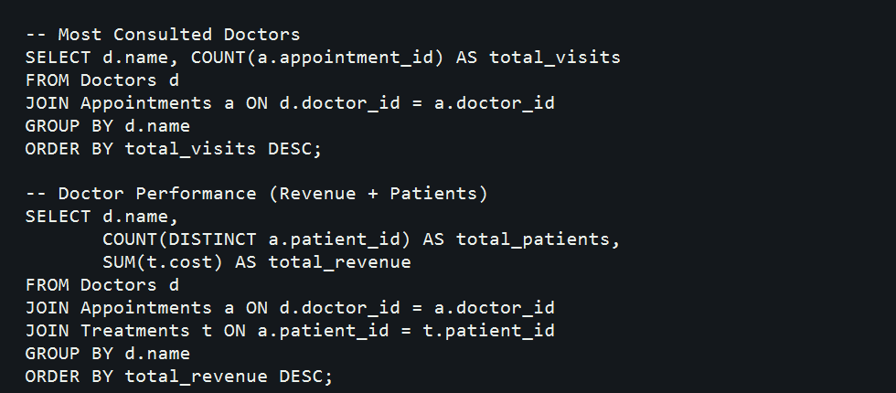

# Hospital Management SQL

## Overview

This SQL project models a simple hospital management system with patients, doctors, appointments, and treatments. It focuses on reporting queries for visits, diseases, and revenue analysis.

## SQL Concepts Used

- Primary keys
- Foreign keys
- `JOIN`
- `GROUP BY`
- `COUNT`
- `SUM`
- `ORDER BY`
- `DATE_FORMAT`
- `DISTINCT`

## Join Logic Used

- `Doctors` joins with `Appointments` to calculate doctor visit counts
- `Patients` joins with `Appointments` to calculate patient visit frequency
- `Doctors`, `Appointments`, and `Treatments` are combined to analyze doctor performance and revenue

## Screenshot

## Author

Suru Harshit
