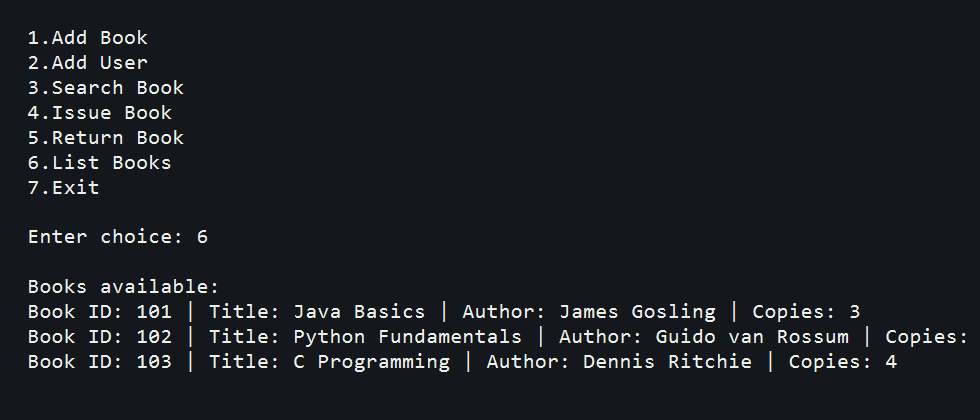

# Library Management System

## Overview

This is a console-based Java project for managing library books, users, issue records, returns, and late fines.

## Features

- Add books
- Add users
- Search books by title
- Issue books to users
- Return books
- Calculate late fine
- Display available books

## Java OOP Concepts Used

- Classes and objects
- Constructors
- Method decomposition
- Encapsulation through class-based modeling
- Collections with `ArrayList`
- Date handling with `LocalDate`

## Screenshot

## Author

Suru Harshit
