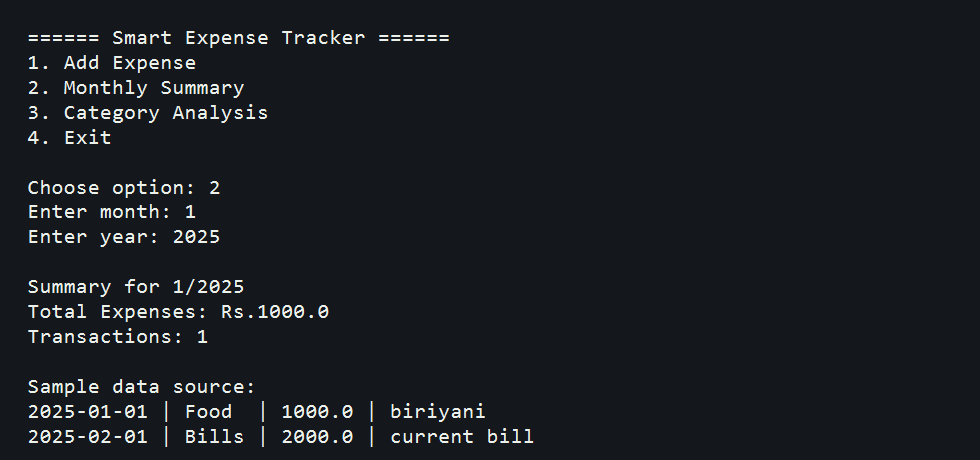

# Smart Expense Tracker

## Overview

This is a console-based Python project for recording daily expenses, storing them in a JSON file, generating monthly summaries, and showing category-wise spending analysis.

## Features

- Add a new expense with date, category, amount, and description
- Store expense data in `expenses.json`
- View monthly total expenses and transaction count
- Analyze category-wise spending
- Display a pie chart using `matplotlib`

## Tools Used

- Python
- `json`
- `os`
- `datetime`
- `collections.defaultdict`
- `matplotlib`

## Files

- `main.py` - main application logic
- `expenses.json` - sample stored expense data

## Screenshot



## How To Run

```bash
pip install matplotlib
python main.py
```

## Logic Explanation For Interviews

- I used a JSON file for lightweight local storage because this project does not need a full database.
- When the user enters an expense, the program validates the date format and stores it in a consistent format.
- For monthly summary, the program reads all expenses, filters them by month and year, and totals the amount.
- For category analysis, the program groups expenses by category and visualizes the result with a pie chart.

## Possible Improvements

- Add edit and delete expense options
- Use a database like SQLite for larger datasets
- Add bar charts and monthly trend analysis
- Build a GUI or web version

## Author

Suru Harshit
